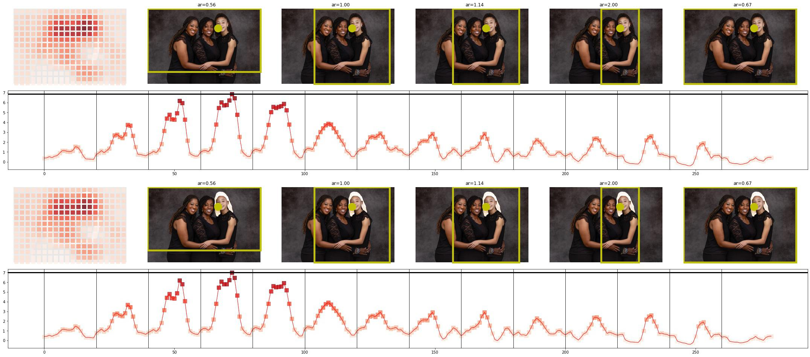

# HALT Saliency Algorithm Bias Evaluation of Group Photos

## Team Name:
[HALT AI](https://www.halt.ai/)

## About HALT AI:
HALT is a female-founded University of Toronto AI startup focused on measuring bias and diversity in AI systems.

## README:
We evaluated Twitter’s saliency algorithm against HALT’s diversity dataset (which includes a representative range of faces in different skin tones, races, genders, and age groups).  We then expanded our evaluation to multi-face scenarios with a focus on disability, age (especially gray hair), and albinism.  The sections below summarize our findings, from most rare to most frequent.

### Bias 1 - Spatial Gaze Bias in abled-disabled group photos
Although rare, we did see a scenario in which the saliency algorithm would be biased against a disabled individual on a wheel chair sitting spatially lower in the photo, while other abled individuals were standing near and were spatially higher in the photo. See this example here:

> *HALT_results/HALT_TwitterAlgoBias_1.jpg*

The example above does not lead to a 1.0 Aspect Ratio crop that blocks out the disabled individual, however, it is possible in other images that this spatial bias towards multiple standing people might disadvantage someone sitting lower in the photo in a wheelchair.

### Bias 2 - Very Dark Skin - Bad Lighting - Bright Object or Logo
Our second observation was that while the saliency algorithm did well in single-face cases, in a few scenarios that involved individuals with very dark skin, non-ideal lighting, and a bright object or logo in the photo, the focus of the saliency moved away from the user's face.  Check out these examples here:

> *HALT_results/HALT_TwitterAlgoBias_2.jpg*

> *HALT_results/HALT_TwitterAlgoBias_3.jpg*

While the above bias requires multiple conditions to be met for it to occur, it does negatively affect individuals with very dark skin. It is likely that with further training on very dark skinned individuals in bad lighting, this situation can be averted. Another option to potentially address this bias would be to pre-process images with varying exposures and produce saliency maps based on the aggregate, which would ideally balance the visibility of all objects in the image.

### Bias 3a - White Hair - Older Individuals
Our most significant finding was a consistent bias in the saliency algorithm against individuals with white hair.  We consistently noticed in our testing that faces with non-white hair were generating a higher saliency score than people with white hair.  In the following examples, the most salient face found is the one without white hair:

> *HALT_results/HALT_TwitterAlgoBias_4.jpg*

> *HALT_results/HALT_TwitterAlgoBias_5.jpg*

> *HALT_results/HALT_TwitterAlgoBias_6.jpg*

> *HALT_results/HALT_TwitterAlgoBias_7.jpg*

While these are just a few examples, we could hardly find any scenarios in which a white hair individual resulted in higher saliency than a non-white hair individual. The situation gets worse when a 1.0 Aspect Ratio cropping cuts out older individuals with white or gray hair.  Here are a few examples:

> *HALT_results/HALT_TwitterAlgoBias_8.jpg*

> *HALT_results/HALT_TwitterAlgoBias_9.jpg*

> *HALT_results/HALT_TwitterAlgoBias_10.jpg*

> *HALT_results/HALT_TwitterAlgoBias_11.jpg*

> *HALT_results/HALT_TwitterAlgoBias_12.jpg*

> *HALT_results/HALT_TwitterAlgoBias_13.jpg*

> *HALT_results/HALT_TwitterAlgoBias_14.jpg*

As shown, the consistently lower saliency score for people with white or gray hair can result, in many cases, in a biased cropping of the photo. Ideally with training for this scenario such situations can be reduced.

### Bias 3b - Albinism 
The white hair bias does not seem to be limited to just older individuals.  In fact, in our testing we found that albinism also results in consistently lower saliency, which in many cases can result in an albino face to be cut out in the cropping.  Here are a few examples:

> *HALT_results/HALT_TwitterAlgoBias_15.jpg*

> *HALT_results/HALT_TwitterAlgoBias_16.jpg*

> *HALT_results/HALT_TwitterAlgoBias_17.jpg*

> *HALT_results/HALT_TwitterAlgoBias_18.jpg*

An interesting situation occurred with the example below, in which an albino individual with a black hair cap did result in the highest saliency face in the photo.

> *HALT_results/HALT_TwitterAlgoBias_19.jpg*

While we do not intend to make conclusions from a single photo, given the bias against older individuals with white/gray hair and albino individuals, it is likely that the bias arises as a result of the hair.

### Bias 3a / 3b Validation
Note that for Bias 3 (a and b), the justification of the harm is that regularly cropping out individuals with white/gray hair due to the saliency algorithm unjustly impacts those individuals.  It is unfair for an algorithm on a platform such as Twitter to routinely crop out specific individuals with a specific facial characteristic.

In order to test our hypothesis regarding the impact of white/gray hair on the saliency algorithm, we performed a small test on 12 multi-person images.  After running the saliency algorithm on these images, we edited the photos to create artificial white hair for the most-salient faces in the image, and re-ran the saliency algorithm. The following images are the results (with the top row being the original photos, and the bottom row being the edited photos):

> *HALT_results/HALT_TwitterAlgoBias_Comp_5_36.jpg*

> *HALT_results/HALT_TwitterAlgoBias_Comp_8_33.jpg*

> *HALT_results/HALT_TwitterAlgoBias_Comp_14_37.jpg*

> *HALT_results/HALT_TwitterAlgoBias_Comp_20_29.jpg*

> *HALT_results/HALT_TwitterAlgoBias_Comp_21_30.jpg*

> *HALT_results/HALT_TwitterAlgoBias_Comp_23_32.jpg*

> *HALT_results/HALT_TwitterAlgoBias_Comp_22_31.jpg*

> *HALT_results/HALT_TwitterAlgoBias_Comp_24_34.jpg*

> *HALT_results/HALT_TwitterAlgoBias_Comp_25_35.jpg*

> *HALT_results/HALT_TwitterAlgoBias_Comp_26_38.jpg*

> *HALT_results/HALT_TwitterAlgoBias_Comp_27_39.jpg*

> *HALT_results/HALT_TwitterAlgoBias_Comp_28_40.jpg*

As observed, in 7 out of 12 cases (58%), whitening the hair of the most salient faces results in a drop in saliency which results in another non-white-hair face being most salient.  Although this is a small test, we believe that it conclusively shows the bias shown against white hair by the current implementation of the saliency algorithm.

## Evidence / Reproducibility:
The link to our GitHub repository can be found [here](https://github.com/erickmu1/Twitter-Algorithmic-Bias). Please refer to the [OLD_README](OLD_README) on how to produce the relevant results from the images provided in the [`HALT_data`](HALT_data) folder.

## Supporting Material / References:
The images referenced can be found in the appropriate folder with the provided GitHub repository link. Likewise, the following [link](https://github.com/erickmu1/Twitter-Algorithmic-Bias/tree/master/HALT_results) is provided for convenience.

## Impact

## Self-Grading Recommendation: 
### Bias 1
Description of Harm: Mis-recognition of disabled individuals

Type of Harm: Unintentional harm
- **Harm Base Score:** [15]
> Mis-recognition.

- **Damage or Impact:** [x1.2]
> This bias affects a marginalized community (individuals in wheelchairs) with moderate impact on the affected person’s well being.

- **Affected Users:** [x1.2]
> Greater than 1M but less than 1B.

- **Likelihood or Exploitability:** [x1.1]
> Occurrence is occasional, but not daily.

- **Justification:** [x1.0]
> Basic justification for the bias and the harm it would cause.

- **Clarity:** [x0.75]
> Some evidence of harm is provided.

- **Creativity:** [x1.0]
> Standard Assessment.

- **Total Score:** [17.82]

### Bias 2
Description of Harm: Mis-recognition of dark skin individuals in bad lighting with a bright object or logo

Type of Harm: Unintentional harm
- **Harm Base Score:** [15]
> Mis-recognition.

- **Damage or Impact:** [x1.2]
> This bias affects a marginalized community (individuals in dark skin) with moderate impact on the affected person’s well being.

- **Affected Users:** [x1.2]
> Greater than 1M but less than 1B.

- **Likelihood or Exploitability:** [x1.2]
> Occurrence is frequent, but not daily.

- **Justification:** [x1.0]
> Basic justification for the bias and the harm it would cause.

- **Clarity:** [x0.75]
> Some evidence of harm is provided.

- **Creativity:** [x1.0]
> Standard Assessment.

- **Total Score:** [19.44]

### Bias 3a / 3b
Description of Harm: Mis-recognition of white haired, elderly and albino individuals

Type of Harm: Unintentional harm
- **Harm Base Score:** [15]
> Mis-recognition.

- **Damage or Impact:** [x1.2]
> This bias affects a large segment of the population (individuals with gray/white hair) with moderate impact on the affected person’s well being (being excluded in photo crops).

- **Affected Users:** [x1.2]
> Greater than 1M but less than 1B.

- **Likelihood or Exploitability:** [x1.3]
> Occurrence is daily, since group photos involving individuals with white/gray hair is very likely.

- **Justification:** [x1.5]
> Basic justification for the bias is straightforward, in that individuals with white/gray hair will be cropped out of group photos.

- **Clarity:** [x1.0]
> Significant evidence of harm.

- **Creativity:** [x1.0]
> Standard Assessment.

- **Total Score:** [42.12]

### Overall Score = 79.38
